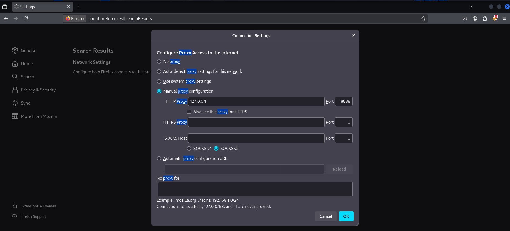

# burp_suite
HTTP Proxy GUI for request interception

Python 3 + PyQt5 HTTP Proxy GUI  
With real-time request interception, forwarding, dropping, replay, filtering and highlighting functions.

---
🚀 Usage

Configure your browser as an HTTP proxy for 127.0.0.1:8888




python burpsuite4.py


All HTTP requests will be visible in the GUI.You can Forward / Drop / Replay by selecting the request.You can search for requests using filters and search.


We can change what we write in the search section


When we look at the query, we see that we are looking for the word hello.


We turn it into a query that we can use "xss".


In the end, our request was forwarded and xss worked


## 📌 Features

- HTTP request capture (GET, POST)  
- Forward / Drop / Replay requests  
- Filter by method, status, or keyword  
- Highlight sensitive keywords (password, token, session)  
- Export captured requests to JSON  
- Clear all captured requests  
- PyQt5 GUI  

---

## ⚙️ Installation

1. Python 3.11+ must be installed 
2. Install PyQt5:

```bash
pip install PyQt5
Clone the project from GitHub:
https://github.com/quliyev-sahin/burp_suite.git 


📝 Export Requests

Exported JSON structure example:
It is possible to export captured requests in JSON format.
json
[
  {
    "id": 0,
    "method": "GET",
    "path": "/test.php",
    "status": "Completed",
    "headers": {
      "Host": "localhost",
      "User-Agent": "Mozilla/5.0"
    },
    "body": ""
  }
]    


